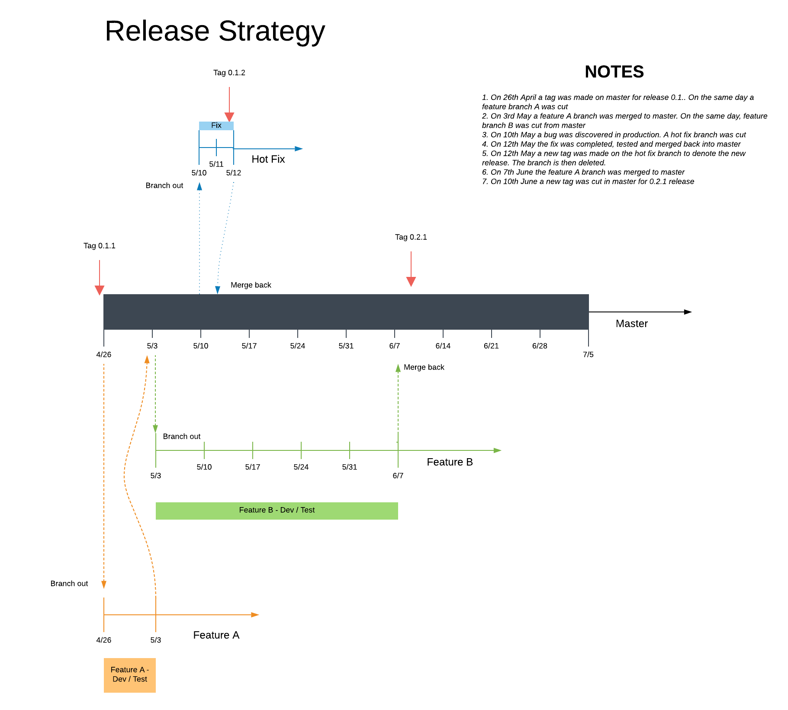

# Branching & Release Strategy

# The Strategy



## Branches & Versions
There will be one permanent branch "master". We will follow semantic versioning everywhere.
All major and minor releases to production happen from master.
It is preferable to keep the master super stable so that it is possible to do patch releases from master as well. 
But if the master is not very stable, it is possible to do patch releases from ephemeral hot fix branches.

## Build Once - Deploy 2 times
All releases must be built once after a tag is made. It is first released to a UAT environment where it is
tested. If UAT passes then the tagged build is propagated to production without re-issuing the build command
again. If UAT fails then the requisite changes are made, the build is tagged as a patch release, re-tested and then pushed to production.
 
## UAT Environments
UAT typically happens in PPE for major and minor releases. (unless the PPE happens to be used for something super
 important which should be very rare) For patch releases, UAT happens in PPE if the release is made from the master branch (preferable). An ephemeral UAT environment can be used if the master is unstable. The ephemeral UAT must use the same downstream resources such as KAFKA topics. This ensures that the whole ecosystem is not replicated to accommodate the hotfix
 environment. However end points are distinct from PPE and may need tweaks to upstream systems to test them.
 
## Tags, Software Versions & Naming

Git Tags will be used to mark the version of the source code in GIT. Tags are better than branches because of the following:
1. They are more light weight (at least by perception) and signify the intent better.
2. They are supported by commands such as "git describe" which trace the last tag and the commits made post taking the tag.
3. Tags can be taken from master or from any other branch. It does not matter even if the branch is deleted. 
4. Tags dont need dedicated CI or permanent environments. They are materialized, hotfixed and decommissioned as required.
5. Tags are immutable. Hence they mandate that a new tag be created when a release happens. This keeps the versioning process 
completely consistent. We cannot deploy a new release without creating a new tag and hence a new version of the software.

Here are the tagging guidelines:
1. We will use annotated tags to keep track of our releases. 
2. A tag is created before a final build is taken for deployment in production. One final validation must happen after taking the tag to ensure that the built deployable is production ready. After generating a deployable, it must be tested in UAT and then moved to production. But see the next section for a caveat.
3. The tag is created in the same branch from where the release happens as specified above.
4. The name of the tag is the same as that of the semantic version of the release. 
 
## Deployment Artifacts and Versions

All deployable artifacts that go to production must have a unique tag. There is no exception to this rule. This means that 
the deployment process to production starts with taking a new tag. The same tag, ideally, must be used to create the UAT 
deployable as well. 

On a rare occassion, if the only changes made in the branch are to make the UAT pass, then the tests might be skipped after 
taking the tag. This is not very recommended since there is a potential for the tagged version of the software
to be different from the tested version. But this is being allowed to make the production deployment process light weight. 

The deployable artifact generated must reflect the tag that was used to make it. The following points are mandatory:
1. The deployable name must have the tag as suffix. For example, price might have an artifact 
with name price-0.0.1.jar where tag name is 0.0.1. This will allow the developers to know the tag that 
generated this deployable.
2. The deployable must support a version end point that can emit the version of the tag. This will allow
an end user to know the version of the what was currently deployed.


# The Process - Release and Branching Commands

This project also contains bash scripts, Makefile, gradle build scripts and some java code that facilitates the guidelines 
that were discussed in the previous section. We will discuss how to use them to accomplish various objectives in this section. 

## To release a major or minor version (from master)

Let us say that we decided to release a major or minor version to production. The release needs to be first
tagged and then the build command must be issued.

All major and minor versions are released with patch version as 1. Let us say we want to release 1.0.1 

This should be released from master. First goto the git folder and make sure that we are at the correct branch
with the changes that need to be tested. Make sure that all changes are committed. The tag process will not be allowed if
there are pending changes. 

Tag the folder using:
```
$ make increment-major | increment-minor | increment-patch # this depends on what you are trying to increment
# The command above automatically triggers a clean build after confirming this with the user.
$ <issue the package command for gradle to generate the docker image>
```

Now push the version built to PPE for testing. If PPE cannot be used, set up a UAT environment and use that for testing.
Once the testing is completed successfully, release this to production by using the same docker image.

If there are changes required to make the UAT pass, change the code and commit the code.
Now when the code is built, you will find that the version is no longer 1.0.1 it will be of the form
1.0.1-1-gd789657.dirty instead. This is because the build is issued after modifications are done to the code base after
the tag was taken. Keep changing the code base till all the tests pass.
If the build is tested properly, finally tag the release by incrementing the patch number. Use "make increment-patch" to 
update the patch number. 

This can then be pushed to production after one last round of validation.

## To make a hotfix
Hotfixes are made on a tagged release by making changes to it in a hot fix branch. Ideally, it should be made from master. But it is possible that at the point of making the hot fix, the master may not be suitable for a release. This is because 
untested changes might exist in the master (which should ideally be avoided) . To make a hot fix, issue the following commands.

```
$ make increment-patch
# the above will ensure that all the changes have been committed first. This may also build the 
# new version of the jar after first confirming that with the user.
$ make create-hotfix-latest 
# this will create a branch with the same name as the tag and prefixed with a "b". For example if tag is 0.0.1 then the branch
# will be b0.0.1

```
## Tag Management
Tags need to be periodically pruned. The following commands can be used to list and delete tags both in local and in the origin.

```
$ make list-local-tags # lists all the tags locally.
$ make list-origin-tags # lists all the tags in origin. 
$ make delete-origin-tag tag=<tagname> # to remove a tag at the origin
$ make delete-local-tag tag=<tagname> # to remove a tag locally.
```

# How to set up a project for release management

The following things need to be done to enable a project for release management as per recommendations in this document:

1. Enable scripts for various activities. 
2. Enable versions in the generated deployable.
3. Feature flags enablement.


## 1. Enable Scripts
For enabling scripts in a project, we need to set up the following:
1. Makefile
2. Bash Scripts 

These files can be copied from this project to your project.


## 2. Enable Versions in the Generated Deployable

You need to do the following:

### a. Tweak the Gradle build file.

1. You should add the Gitversion plugin into the gradle file.
2. You should extract the version from the Gitversion() function that is exposed by the plugin.
3. You should ensure that the java resources are filtered and the application version substituted in them. See the next subsection. 

### b. Java Resource Filtering & Generated Artifacts

Gradle and Maven support resource filtering. This means that every resource that is present in src/main/resources is put
through a filter before it gets packaged into the final generated jar file (or WAR or EAR file).

The most common use case for resource filtering is to make variable substitutions in the resource file. For example, if a 
variable called @application.version@ exists in the resource file, then it is substituted with the actual application 
version at the time of generating the jar. This needs changes in the gradle build (or maven pom). This change is demonstrated 
in the gradle build that exists in this project.

### c. Version library

There must be a version library that reads the filtered resource (version.txt) and emits out the version of the deployable.The version library is included in this project.


## 3. Feature Flags

All feature flags must be standardized into one feature file - features.txt that will be in src/main/resources
This file will be checked into git. At the time of merging the feature branch into master this file might
need to be changed to toggle the feature flags on or off.

All feature flags must be short lived. It is indeed preferable to get rid of them once they are production ready.
Distinction must be made between permanent and temporary feature flags. Temporary feature flags must begin  with
temp- and must be got rid of at the earliest convenient time.

A feature request must be created to get rid of the temp flags in JIRA and must be prioritized once the feature
is main streamed.
